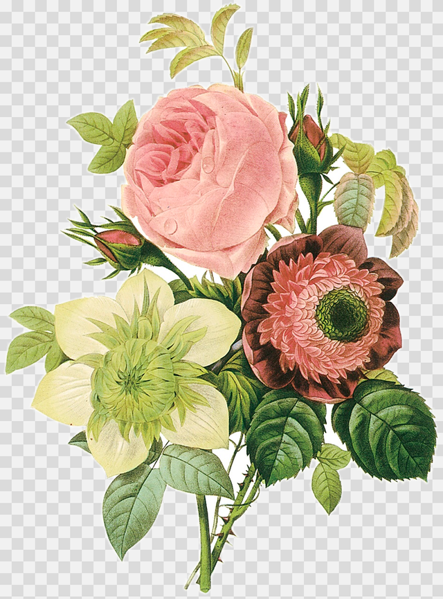
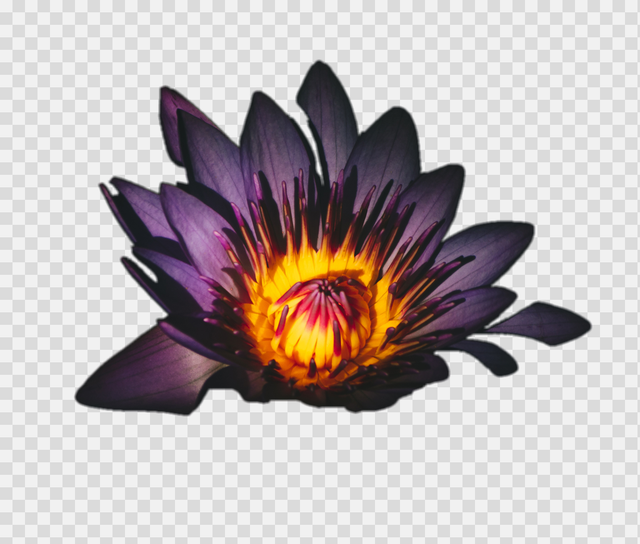
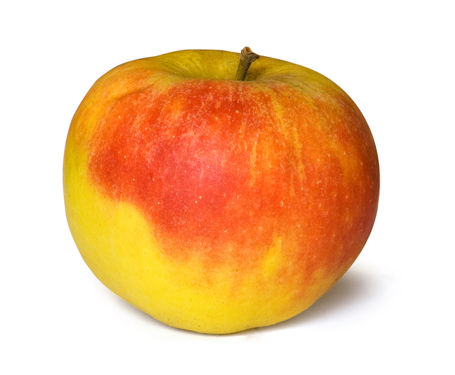
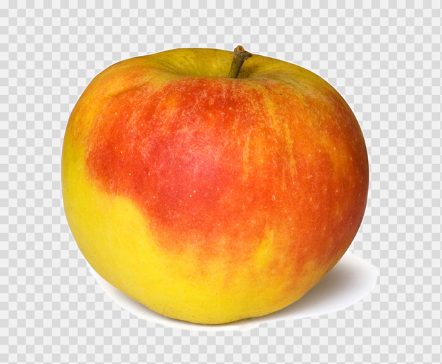

# BorderCut

**Background removal in about 8 kB gzipped. Runs entirely on your device.**

BorderCut removes separable backgrounds with a tiny, dependency-free algorithm. Embed it in a browser, Web Worker, Node.js application, or a Dart/Flutter client. Images stay on the device doing the processing. Once the code is loaded, it works offline: no server, API key, model download, or GPU is required.

The TypeScript core is **7.9 kB minified + gzipped**. The optional browser file-to-PNG adapter, including the entire core, is **8.7 kB minified + gzipped**. Both have **zero runtime dependencies**. The native Dart core is also dependency-free; the Flutter adapter adds engine codecs and isolate processing.

Use it for product shots, graphics, and other images whose subjects are distinguishable from the background at the image boundary. Difficult scenes can need Remove/Keep guidance; this is a classical image-processing algorithm with [known limits](#known-limits).

## Run locally in your app

```ts
import { removeBackground } from '@bordercut/core';

const { image, alpha } = removeBackground({ width, height, data: rgba });
```

In a browser, pass a local `File` or `Blob` directly to the optional adapter:

```ts
import { removeBackgroundFromBlob } from '@bordercut/core/browser';

const { blob } = await removeBackgroundFromBlob(file); // Transparent PNG, processed locally.
```

For a site without a bundler, build the package with `npm ci && npm run build --workspace @bordercut/core`, copy `packages/typescript/dist/browser.min.js` into your site, and import it from a module script:

```js
import { removeBackgroundFromBlob } from './browser.min.js';
```

That file is a standalone ES module with no additional imports. Use `core.min.js` instead when you already have decoded RGBA pixels. Both files also ship in the npm tarball. Serve them with your own application; no CDN or hosted processing service is required. For responsive interfaces, run processing in a [Web Worker](examples/minimal-web/src/removal-worker.ts).

Packages are not published yet; clone this repository and use the [working examples](#supported-runtimes) to get started. The project is **pre-1.0 alpha software**, MIT licensed, with a versioned algorithm contract. Package APIs may change between minor releases.

## Small enough to embed

<!-- size:start -->
| Standalone module | Minified | Minified + gzip | Minified + Brotli |
| --- | ---: | ---: | ---: |
| `core.min.js` | 20.6 kB | 7.9 kB | 6.9 kB |
| `browser.min.js` | 22.7 kB | 8.7 kB | 7.7 kB |
<!-- size:end -->

These are measured sizes of the complete standalone JavaScript modules, using esbuild minification, gzip level 9, and Brotli quality 11; 1 kB = 1,000 bytes. The browser row includes the core, so the two rows are alternatives. Source maps, documentation, and example UI are excluded. Compressed transfer sizes are not the npm archive size, installation size, runtime memory use, or a Dart/Flutter app-size claim. Actual transfer size depends on server compression.

Run `npm run size` to reproduce the measurement, or `npm run docs:size` to refresh this table and the [exact byte counts and bundle hashes](docs/size/latest.json). CI enforces gzip limits of 8,000 bytes for the core and 9,000 bytes for the browser adapter, and rejects runtime dependencies or external imports in the standalone modules.

## Before and after

<!-- showcase:start -->
| Example | Before | After |
| --- | --- | --- |
| Butterfly specimen · fine antennae and patterned wings |  |  |
| Vintage botanical print · pale petals and branching stems |  |  |
| Dark flower photo · low-contrast petal edges |  |  |
| Product photo · white background |  |  |

Actual BorderCut outputs, without manual retouching or correction strokes. The butterfly disables `recoverPaleSubject` to reduce the retained pale rim; other settings are defaults. The flower uses an explicit crop, identical before and after processing. The checkerboard displays transparency. Processing uses images up to 1024 pixels on the longest edge.

These examples also show the limits: thin edge halos remain, some very dark petal detail merges with the backdrop, and the apple retains part of its contact shadow. Selected examples are not a general segmentation accuracy benchmark. [Exact inputs, settings, source credits, and reproduction](docs/showcase/README.md).

Butterfly photograph by [Notafly](https://commons.wikimedia.org/wiki/File:Papiliorex_Oberth%C3%BCr,_1886.JPG), [CC BY-SA 3.0](https://creativecommons.org/licenses/by-sa/3.0/); its resized and background-removed derivatives retain that license. Botanical illustration by Pierre-Joseph Redouté (public domain); flower photograph credited to Ameen Fahmy on Commons (CC0); apple photograph by Amada44 (public domain).
<!-- showcase:end -->

## Performance

<!-- benchmark:start -->
Measured 2026-09-06 with Node v24.11.1 on Intel(R) Core(TM) Ultra 9 275HX, win32 x64. Algorithm v1.

| Input | Pixels | Median | p95 |
| --- | --- | ---: | ---: |
| butterfly | 512 × 384 | 29.9 ms | 59.9 ms |
| butterfly | 1024 × 768 | 102.6 ms | 113.7 ms |
| butterfly | 2048 × 1536 | 414.8 ms | 440.9 ms |
| botanical | 379 × 512 | 28.5 ms | 40.4 ms |
| botanical | 758 × 1024 | 109.8 ms | 129.3 ms |
| botanical | 944 × 1275 | 172.5 ms | 198.2 ms |
| flower | 512 × 435 | 38.6 ms | 41.9 ms |
| flower | 1024 × 871 | 167.5 ms | 190.4 ms |
| flower | 2048 × 1741 | 717.3 ms | 769.7 ms |
| apple | 512 × 422 | 30.1 ms | 41.5 ms |
| apple | 1024 × 844 | 126.4 ms | 140.7 ms |
| apple | 2011 × 1657 | 535.3 ms | 572.3 ms |

5 warm-up calls and 20 timed calls per row. Times cover the synchronous TypeScript algorithm and its allocations; they exclude decoding, cropping, resizing, PNG encoding, file I/O, and worker overhead. p95 uses nearest rank. Inputs, crops, and options match the showcase cases; images are never enlarged.

These are measurements on one development machine, not latency guarantees or Dart/Flutter/browser measurements. Content, settings, runtime, hardware, and background activity affect timings. [Raw samples, source hashes, and environment](docs/benchmarks/latest.json) are retained so results can be compared honestly.

Reproduce with `npm ci && npm run benchmark`. Regenerate previews separately with `npm run docs:showcase`.
<!-- benchmark:end -->

## Supported runtimes

| Target | Integration |
| --- | --- |
| Modern browsers | ES2022 pixel core or native Blob/PNG adapter; [minimal web example](examples/minimal-web) |
| Web Workers | The same TypeScript core off the UI thread; [worker example](examples/minimal-web/src/removal-worker.ts) |
| Node.js 20.19+ | Pixel core with your chosen codecs; [file-to-PNG example using sharp](examples/node-sharp) |
| Dart | Native pixel implementation; [package and usage](packages/dart) |
| Native Flutter apps | Engine codecs and isolate processing; [adapter and usage](packages/flutter) |

TypeScript and Dart implement algorithm v1 and share the same options, fixtures, and byte-exact fixture alpha output. Image decoding, file access, and platform integration stay in adapters. The Flutter isolate adapter targets native apps; browser apps use the TypeScript implementation.

## Repository layout

```text
bordercut/
  spec/                    Language-neutral algorithm and schemas
  fixtures/v1/             Shared cross-language conformance cases
  packages/
    typescript/            Publishable @bordercut/core package
    dart/                  Pure-Dart algorithm-v1 package
    flutter/               Flutter codecs and isolate adapter
  examples/
    minimal-web/           Unbranded Web Worker integration example
    node-sharp/            Runnable Node file adapter example
```

The core packages accept decoded RGBA bytes. Image codecs, resizing, UI, files, and networking stay in adapters and applications.

## Run locally

For TypeScript, Node.js 20.19 or newer and npm are required.

```bash
npm ci
npm run check
npm run dev
```

The example is served locally by Vite. Its production build is written to `examples/minimal-web/dist/`; the TypeScript library is written to `packages/typescript/dist/`.

For Dart and Flutter workspace development, use Flutter 3.41.7, matching CI.
Run these commands from the repository root:

```bash
flutter pub get
dart analyze packages/dart
dart test packages/dart
flutter analyze packages/flutter
flutter test packages/flutter
```

## TypeScript API

```ts
import { removeBackground } from '@bordercut/core';

const result = removeBackground(
  { width, height, data: rgba },
  {
    tolerance: 46,
    edgeProtection: 58,
    feather: 2,
    cleanup: 1,
    protectCenter: true,
    recoverPaleSubject: true,
    interiorBackground: false,
  },
  {
    strokes: [
      {
        kind: 'background', // remove this painted line
        radius: 8,
        points: [{ x: 24, y: 30 }, { x: 80, y: 42 }],
      },
    ],
  },
);

// result.image: transparent RGBA image
// result.alpha: one-byte alpha mask
// result.diagnostics.algorithmVersion: portable algorithm contract version
```

The package has no runtime dependencies. The default core entry does not decode or encode image files.

For a one-call browser workflow, the optional `@bordercut/core/browser` subpath accepts a `Blob` or `File` and returns the complete result plus a transparent PNG `Blob`:

```ts
import { removeBackgroundFromBlob } from '@bordercut/core/browser';

const { blob, diagnostics } = await removeBackgroundFromBlob(file);
```

This adapter uses browser-native codecs and remains separate from the default entry point. Interactive applications should process pixels in a Web Worker, as demonstrated by `examples/minimal-web`. Node applications can follow the runnable `examples/node-sharp` integration.

Inputs are validated at runtime. Width and height must be positive safe integers, RGBA data must be a sufficiently large `Uint8ClampedArray`, numeric options must be finite and within their documented ranges, and correction samples and strokes must fall inside the image.

The optional third argument accepts `{ samples, strokes }`. Samples influence classification and connected-region decisions within an engine-derived area. Brush strokes seed smart, color- and edge-aware local region guidance: `background` guides removal and `foreground` guides subject retention. Their effect may extend beyond the painted line, but bounded reach prevents a stroke from following matching colors across the image. Strokes run in array order after the global baseline is stable: a new Remove stroke can only lower alpha, while a new Keep stroke can only raise it. Stroke radius and points use image-pixel coordinates, and later strokes override earlier grown corrections where they reach. Passing a sample array directly remains supported for compatibility.

## Dart and Flutter APIs

The pure Dart package exposes the same pixel-level contract without JavaScript,
FFI, network access, or runtime dependencies:

```dart
final result = removeBackground(
  PixelImage(width: width, height: height, data: rgba),
  guidance: const RemovalGuidance(
    strokes: [
      BrushStroke(
        kind: SampleKind.background,
        radius: 8,
        points: [StrokePoint(x: 24, y: 30), StrokePoint(x: 80, y: 42)],
      ),
    ],
  ),
);
```

The separate Flutter adapter keeps engine concerns out of the core package. It
can decode supported image bytes, run the algorithm outside the UI isolate, and
encode the result as a transparent PNG:

```dart
final output = await removeBackgroundFromBytes(encodedImageBytes);
final transparentPng = output.png;
```

See [`packages/dart`](packages/dart) and [`packages/flutter`](packages/flutter)
for complete package usage.

## Algorithm overview

1. Sample and cluster plausible background colors around the image perimeter.
2. Fit a spatial color plane when the boundary supports a smooth gradient.
3. Score pixels using background distance, edge strength, center protection, and optional correction markers.
4. Flood-fill only background connected to trusted exterior seeds.
5. Recover pale subject material using blurred color evidence when the learned background is sufficiently regular.
6. Seal narrow, low-contrast false cutouts while preserving wider or high-contrast openings.
7. Clean and feather the alpha mask, then decontaminate semi-transparent edge colors.

See [the algorithm v1 specification](spec/algorithm-v1.md) for the portable contract.

## Controls

- **Background reach** broadens or narrows accepted background colors.
- **Edge protection** makes visible transitions harder to cross.
- **Edge softness** feathers the alpha boundary.
- **Speck cleanup** removes isolated pixel decisions.
- **Protect the center** adds a weak centered-subject prior.
- **Recover pale subject** repairs light material that resembles a regular backdrop.
- **Open interior holes** removes confident enclosed background regions.
- **Remove brush** guides removal through nearby, visually similar background.
- **Keep brush** guides subject retention through nearby, visually similar material.
- **Brush size** controls how much evidence each correction stroke supplies.

The included examples demonstrate these controls and library integration.

## Cross-language compatibility

Every implementation should:

- expose the option names and defaults in `spec/options.schema.json`;
- report its supported algorithm version;
- pass the shared cases in `fixtures/v1/cases.json`;
- remain deterministic for identical bytes, dimensions, options, and correction guidance.

TypeScript remains the specification reference. The Dart port is independently implemented and must retain byte-exact alpha compatibility with every published algorithm-v1 fixture.

## Known limits

No rule-based tool can infer semantics in every image. A white subject in snow, a subject covering every edge, motion blur, or highly detailed scenery may need correction strokes or a semantic model. BorderCut is strongest on product photos, portraits with separable backgrounds, chroma-key images, studio gradients, icons, screenshots, and controlled illustrations.

## Contributing

See [CONTRIBUTING.md](CONTRIBUTING.md). Behavioral changes should update tests and, when applicable, the shared portable fixtures. Community expectations, support, security reporting, governance, and release history are documented in:

- [CODE_OF_CONDUCT.md](CODE_OF_CONDUCT.md)
- [SUPPORT.md](SUPPORT.md)
- [SECURITY.md](SECURITY.md)
- [GOVERNANCE.md](GOVERNANCE.md)
- [CHANGELOG.md](CHANGELOG.md)

The local release checklist is in [RELEASING.md](RELEASING.md). Public hosting and package publication remain manual maintainer decisions.

## License

Code: MIT. Showcase images retain their [documented source licenses](docs/showcase/README.md).
